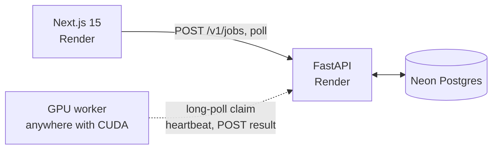

# Smriti

স্মৃতি — *memory*. Diffusion restoration for damaged and ageing photographs: repair tears and
scratches, reduce noise, colourise, upscale, and restore faces — as five independently reported
pipeline stages behind a fault-tolerant job queue.

**Live demo:** _pending deploy_ · **API docs:** _pending deploy_

> **Current status: complete and deployed, no GPU attached.** The control plane, queue, worker
> protocol, damage detection and evaluation harness all run. What is missing is a GPU to attach, so
> the live site says so rather than pretending. The model card stays empty until the harness has
> measured something.

---

## Why this is more than a wrapper

Restoration is one of the few generative tasks with **obtainable ground truth**. Degrade a clean
photograph in a known way, restore it, compare against the original — and PSNR, SSIM and perceptual
distance become measurements rather than opinions. That is the whole reason this project exists in
this form.

The engineering position that follows from it: **generative models should touch as little as
possible.**

## Two rules the pipeline obeys

**Diffusion runs on regions, not frames.** A model asked to redraw a whole photograph will change
things that were never damaged. Damage is detected, grouped into bounding boxes, and inpainted box
by box. Three scratches cost three small inpaints, not a full-frame pass.

**Undamaged pixels come out bit-for-bit identical.** Every composite goes back through a feathered,
mask-restricted blend, so the repair is confined to the damage. A restoration that quietly rewrites
clean areas is not a restoration.

## Pipeline

Fixed order, because the order matters:

```
descratch → denoise → colorize → upscale → face_enhance
```

Repair precedes upscaling so super-resolution is never asked to faithfully reconstruct a scratch.
Face restoration follows upscaling so it works at full output resolution.

| Stage | How |
|---|---|
| **descratch** | Top-hat and black-hat morphology isolate thin high-contrast defects. Components are kept or rejected by **fill ratio**, not bounding-box elongation — a diagonal scratch has a near-square bbox, so elongation misses it entirely. SD inpainting repairs each region. |
| **denoise** | Non-local means, blended back against the original so real film grain survives. |
| **colorize** | Colour inferred by img2img on a reduced copy, then **only the LAB chroma is transferred** onto the original luminance. Measured drift: under 1 part in 255, so no detail is lost. |
| **upscale** | x4 diffusion upscaler over overlapping tiles, feathered at the seams. Peak VRAM stays flat whatever the input size, with a per-tile fallback to resampling if a tile OOMs — one bad tile degrades, it does not fail the job. |
| **face_enhance** | Three OpenCV cascades (frontal, alt2, mirrored profile) locate faces; a low-strength img2img pass refines them, capped so identity cannot drift. |

## Measured, on synthetic ground truth

`scripts/check_imaging.py` validates the classical layer on CPU in seconds, against damage it
generated and therefore knows exactly:

```
damage detect : recall=1.00  flagged=2.37% of frame (2.9x true damage area)
clean image   : flagged 0.000%
regions       : 6 boxes covering 96.1% of damage
composite     : mean drift on undamaged pixels = 3.34 / 255
chroma xfer   : luminance change mean=0.891 / 255
denoise       : mean abs error 11.17 -> 4.95
```

The flagged area exceeding true damage is intentional: the mask is dilated to give inpainting clean
context on both sides of a scratch.

`ml/evaluate.py` measures the full pipeline. Eight degradation recipes — scratches, creases, grain,
fade, blur, JPEG generational loss, lost resolution, and everything at once — each scored with PSNR,
SSIM and a VGG16 perceptual distance. Results land in `eval/results.json`, triptychs
(clean | degraded | restored) in `eval/samples/`, and `--publish` posts them so the live model card
renders measurements.

## Privacy is a design constraint

These are people's family photographs, so it is not a footnote:

- Uploads and results are **private by default**, never public unless explicitly opted in.
- Everything is deleted automatically within **48 hours**, on a clock separate from showcase retention.
- `DELETE /v1/jobs/{id}` lets an owner erase a photograph **immediately**, without waiting for a sweep.
- The showcase needs **two gates**: uploader opt-in *and* a manual admin feature. There is no
  "recent uploads" feed, because that is a privacy hazard dressed up as a gallery.
- EXIF is stripped as a side effect of normalisation on upload.

## Architecture



Workers **pull**, so nothing connects inbound — no tunnel, no static IP, no open port. The claim is a
single atomic `UPDATE ... FOR UPDATE SKIP LOCKED`, and it matches on **capability**: a worker must be
able to run every stage a job asks for and hold the output in VRAM, or it is not offered the job. So
a worker that only does `upscale` is safe to run.

Leases, heartbeats and bounded retries mean a worker dying mid-pipeline costs a retry, not the
photograph. This architecture is shared with
[nakshi-studio](https://github.com/Somokolon-Labs/nakshi-studio), where it was verified under
injected failure — a worker killed mid-run had its job requeued and completed on the next attempt.

## Quick start

```bash
cp .env.example .env
python -m venv .venv && .venv\Scripts\activate
pip install -r api/requirements.txt
cd api && uvicorn app.main:app --reload      # http://127.0.0.1:8000/docs
cd web && npm install && npm run dev         # http://localhost:3000
```

Validate the imaging layer without a GPU:

```bash
pip install opencv-python-headless Pillow numpy
python scripts/check_imaging.py
python scripts/check_faces.py                # needs PEXELS_ACCESS_KEY
```

With a GPU:

```bash
pip install torch==2.5.1 torchvision==0.20.1 --index-url https://download.pytorch.org/whl/cu121
pip install -r worker/requirements.txt
python -m worker.main --self-test photo.jpg  # restore locally, post nothing
python -m worker.main                        # join the queue
python -m ml.evaluate --per-degradation 4 --publish
```

## Known limitations

Stated on `/model` too, because they matter:

- **Face detection misses non-frontal poses.** The cascades found faces in four of six real test
  portraits. A missed face is left untouched rather than damaged, which is the safe failure, but this
  is face-*aware refinement*, not a dedicated face-restoration network. Swapping in a learned
  detector is a one-function change.
- **Colour is fabricated.** Colourisation is a plausible interpretation, never a recovery.
- **Detail at 4x is synthesised.** It looks right; it is not evidence.
- **Heavy damage above ~⅓ of the frame** makes the detector stand down, on the grounds that it has
  probably latched onto texture. Use the manual brush.
- **Not for forensic, legal, medical or journalistic use.** Every generative stage adds detail that
  was not in the original.

## Licence

MIT for the code. Inference uses Stable Diffusion 1.5 checkpoints under the CreativeML Open RAIL-M
licence.

Built by Shahriar Ahmed Seam / Somokolon Labs.
